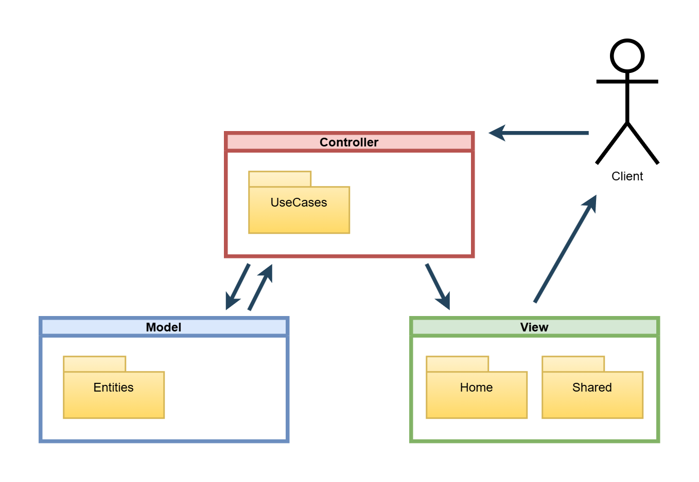

# Flags Tijuana MVC

This application was developed using ASP.NET Core 8 and PostgreSQL. It implements a basic feature flag system following the MVC (Model-View-Controller) architecture.

## Diagram


## 📦 Requirements
- [.NET 8 SDK](https://dotnet.microsoft.com/en-us/download/dotnet/8.0)
- [Visual Studio 2022+](https://visualstudio.microsoft.com/) or any IDE with .NET support
- [PostgreSQL](https://www.postgresql.org/)
- [NodeJS v22.11.0](https://nodejs.org/es)

## 🚀 Getting Started

1. **Clone the repository**
```bash
  git clone https://github.com/danielmontes9/flags-tijuana-mvc.git
  cd flags-tijuana-mvc
```

2. **Restore dotnet dependencies**
```bash
  dotnet restore
```

3. **Apply EF Core migrations**
```bash
  dotnet ef database update
```
💡 Make sure your appsettings.json connection string is correctly configured for your local database.

4. **Restore node dependencies**
```bash
  npm install
```
⚠️ This step is important to ensure that commit hooks (e.g., Husky, commit-lint) run correctly during development.

5. **Run the project**
```bash
  dotnet run
```
Open it in your browser (e.g. https://localhost:7162/)

## ⚙️ Configuration
Environment-specific settings can be found in:

- appsettings.Development.json

- appsettings.Production.json

Update connection strings, secrets, and other environment variables as needed.

## ✅ Useful Commands
```bash
  dotnet build             # Build the project
  dotnet run               # Run the project
  dotnet watch run         # Hot reload during development
  dotnet ef migrations add <Name>  # Add a new migration
  dotnet ef database update        # Apply latest migrations
```

## Author

- [@danielmontes9](https://github.com/danielmontes9)